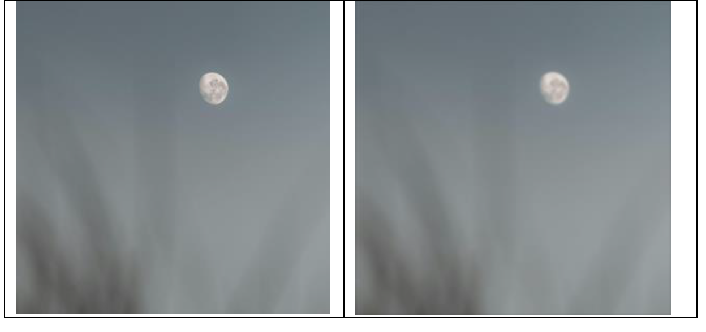

# Convolutional filter(s) for images


## Introduction
This project is a simple multi-thread convolutional filter for images. It reads a batch of images from a file, applies a filter to each image, and writes the output to a different file. The filter is defined in a text file. The program uses OpenMP to parallelize the convolutional layer. Here we use a 5x5 filter with 1/273 normalization factor. The filter is applied to each color channel of the image. 5 threads are used to parallelize the convolutional layer which the stride(which is 1) and zero-padding of the filter can be set in the convolutional layer. The output layer dimensions are calculated automatically. 

Note: The program can only run on a linux machine, as it uses OpenMP for parallelization and windows does not support the compiler.

* Images are stored in folder input/grey. All images should be of the same size (In our case 300x300) and in the same folder for the program to work.

* Python Imaging Library (PIL) was used to convert images into RGB matrices and to convert filtered matrices back to images. 
PIL was preferred over other C++ libraries due to ease of use.

## Code structure
### Helpers:
  * make\_mats.py:
  This script converts images into a matrix format(matrices) and saves the data to a file.
  * load\_img.py:
  This script reads image data from a file(matrices), reconstructs the images, and saves them as BMP files. The images are stored in a file.


  ### Source:
  * Filter.hpp: 
  Defines a 3-D convolutinal kernel class with a bias term. The class contains a method to apply the filter to a 3-D data block.
  It contains some helper functions to allocate memory to tensors and to normalize them.
  - get\_tensor: This function dynamically allocates a 3D array (tensor) to store filter weights.
  - normalize: This function normalizes the filter weights by dividing each element by the sum of all elements.
  * Convolution.hpp: 
  Defines a convolutional layer. One can set the stride and zero-padding of the filter in this. Also, dimensions of the output layer are calculated automatically.
  * conv2d method takes as argument a 3-D data volume and a list of filters (one filter generates one activation map). 
  
  For example, applying a 5 x 5 x 3 filter on a 300 x 300 x 3 image (with 1 zero padding and 1 stride) will generate an 2-D output layer of 300 x 300. 
  
  * List of filters would make the output layer. Shape of output layer as well as the data block is returned by the function conv2d.

  * Main.cpp runs some example filters on a batch of 3 images. It generates 3 filters, one as an edge detector for each color channel (see push\_filter). Then defines
    a convolution layer with given params and applies the layer to each of the images. It then writes the output to a different file.
  *Inside helpers directory, we have make\_mats.py and load\_img.py that are used to generate images\-matrices and vice versa.

```cpp
for (int id = 0; id < num_images; ++id) {
  ...
  auto output = clayer.conv2d(input, filters);
  ...
}
```

## Steps to run
* First and foremost install the required libraries:

```bash
sudo apt update
sudo apt install python3-pip
pip install -r requirements.txt
```

* Compile using make. Build file for convolutional filter demo program is 'main'. 

* The ```run.sh``` file allows us to run both ```makefile``` and the rest of python commands that's going to execute the overall project.
To run the project:
1. First of all make sure that ```run.sh``` has excutable permissions:

```bash
chmod +x run.sh
```
2. Run the ```run.sh``` file:


```bash
./run.sh
```

```bash
rm *.o main
g++  -std=gnu++11 -O2 filter.hpp -o filter.o
g++  -std=gnu++11 -O2 conv2d_layer.hpp -o conv2d_layer.o
g++  -std=gnu++11 -O2 main.cpp -o main
```

* List of images to use is in file make\_mats.py. In the demo it uses a batch of 3  300 \* 300 \* 3 (color) images.

```bash
python3 make_mats.py img_mats/out.dat
```

* Run the convolutional filter (read from standard input)

```bash
./main img_mats/out.dat img_mats/filter_out.dat < filter.txt
```

* Make output images from matrices

```bash
python3 load_img.py img_mats/filter_out.dat out_mats
```

## Results

You can checkout the image results in the out_mats directory. The output images are generated by applying a filter to the input images. 
The filter is defined in filter.txt, which is the given kernel with 1/273 normalization factor. So the Matrix is stored on the file after normalization.

The output images are stored in out_mats inside output directory.

The output images are stored in out_mats inside output directory.

Check out a couple of images with the filters applied:





